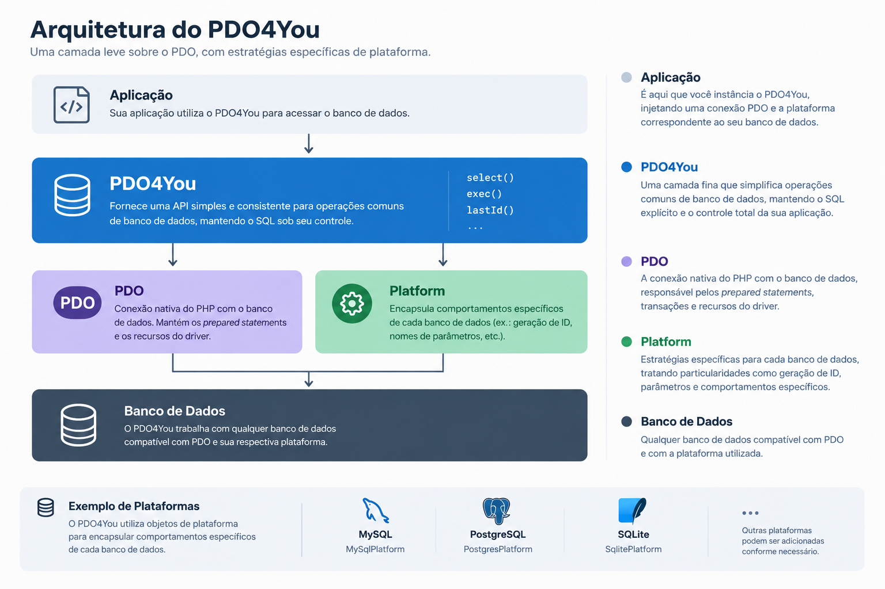

# PDO4You

[](https://www.php.net/)
[](LICENSE)

*[Read documentation in English](README.md)*

**Um wrapper de banco de dados moderno, leve e testável para PHP.**

O **PDO4You** simplifica o uso do PDO sem adicionar o overhead e a complexidade de um ORM completo.

Construído para **PHP 8.2+**, o PDO4You mantém o SQL sob seu controle enquanto adiciona uma camada de abstração para facilitar operações comuns de banco de dados, injeção de dependência e estratégias específicas de plataforma.

> **PDO4You não substitui o PDO. Ele trabalha junto com ele.**

---

## ✨ Características

* 🚀 **Leve** — uma camada fina sobre o PDO com overhead mínimo.
* 🧩 **Simples** — continue escrevendo SQL nativo e mantendo controle total sobre as consultas.
* 💉 **Testável** — suporte completo a injeção de dependência (`PDO` e `DatabasePlatform`).
* ⚡ **Inicialização Rápida** — fábrica `connect()` com resolução automática de plataforma a partir do DSN.
* 📦 **PSR-4** — autoloading padrão compatível com Composer.
* 🐘 **PHP moderno** — tipagem estrita e recursos do PHP 8.2+.
* 🔌 **Estratégias por plataforma** — abstração de particularidades (como obtenção de último ID) para MySQL, PostgreSQL e SQLite.
* 🛡️ **Segurança nativa** — prepared statements em todas as operações com parâmetros.
* 🔄 **Transações Gerenciadas** — controle transacional seguro via closures com rollback automático.
* 📊 **Observabilidade** — listener global para logging, profiling e monitoramento de tempo de execução.
* 🚫 **Sem ORM** — sem entidades, sem mapeamentos complexos obrigatórios.

---

## 📦 Instalação

Instale o PDO4You através do Composer:

```bash
composer require giovanniramos/pdo4you
```

---

## ⚡ Início Rápido

Você pode inicializar o PDO4You de duas formas: automaticamente via string DSN ou injetando uma conexão PDO existente.

### 1. Inicialização Automática (Recomendada)

O método estático `connect()` infere a plataforma correta pelo driver do DSN (`mysql`, `pgsql` ou `sqlite`):

```php
<?php

use PDO4You\PDO4You;

$db = PDO4You::connect(
    'mysql:host=localhost;dbname=mydb;charset=utf8mb4',
    'usuario',
    'senha'
);
```

### 2. Injeção Manual de Dependências

Ideal para quem utiliza contêineres de DI (Injeção de Dependências) ou deseja reaproveitar conexões existentes:

```php
<?php

use PDO;
use PDO4You\PDO4You;
use PDO4You\Platform\MySqlPlatform;

// 1. Crie sua conexão PDO
$pdo = new PDO(
    'mysql:host=localhost;dbname=mydb',
    'usuario',
    'senha'
);

// 2. Instancie a plataforma correspondente
$platform = new MySqlPlatform();

// 3. Injete as dependências no PDO4You
$db = new PDO4You($pdo, $platform);
```

---

## 🧑‍💻 Uso

### Consultas (SELECT)

O PDO4You oferece métodos específicos para cada necessidade de leitura:

#### `select()` — Array associativo ou mapeamento de classe
```php
// Retorna um array associativo
$users = $db->select(
    'SELECT * FROM users WHERE status = ?',
    ['active']
);

// Mapeamento direto para instâncias de uma classe (FETCH_CLASS)
$users = $db->select(
    'SELECT * FROM users WHERE status = ?',
    ['active'],
    UserDTO::class
);
```

#### `selectOne()` — Buscar uma única linha
Retorna apenas o primeiro registro, evita o carregamento do conjunto de dados completo na memória:

```php
$user = $db->selectOne('SELECT * FROM users WHERE id = ?', [1]);

if ($user) {
    echo $user['name'];
}
```

#### `selectVal()` — Valor escalar
Retorna diretamente o valor da primeira coluna (útil para contagens e somas):

```php
$total = $db->selectVal('SELECT COUNT(*) FROM users WHERE status = ?', ['active']);
```

#### `selectObj()` — Array de objetos anônimos (`stdClass`)
```php
$users = $db->selectObj('SELECT name, email FROM users');

foreach ($users as $user) {
    echo $user->name;
}
```

#### `selectNum()` — Array indexado numericamente
```php
$rows = $db->selectNum('SELECT id, name FROM users');
// $rows[0][0] = id, $rows[0][1] = name
```

---

### Execução (INSERT, UPDATE, DELETE)

O método `exec()` é responsável por operações de modificação e retorna a quantidade de linhas afetadas.

#### Execução Simples
```php
// UPDATE
$affected = $db->exec(
    'UPDATE users SET status = ? WHERE id = ?',
    ['inactive', 5]
);

// DELETE
$affected = $db->exec(
    'DELETE FROM users WHERE id = ?',
    [10]
);
```

#### Execução em Lote (Batch Insert / Batch Update)
Ao passar uma lista de arrays, o PDO4You reutiliza a mesma instrução preparada para executar todos os itens de forma eficiente:

```php
$totalInserted = $db->exec(
    'INSERT INTO users (name, surname) VALUES (?, ?)',
    [
        ['John', 'Doe'],
        ['Jane', 'Doe'],
        ['Alice', 'Smith']
    ]
);
```

---

### Último ID Inserido

Obtém o identificador gerado na última operação utilizando a estratégia correspondente à plataforma ativa:

```php
$db->exec('INSERT INTO users (name) VALUES (?)', ['John']);

$userId = $db->lastId();

// Para PostgreSQL com sequences específicas:
// $userId = $db->lastId('users_id_seq');
```

---

### Transações Gerenciadas

O método `transaction()` encapsula as operações em um bloco transacional seguro. Se o callback executar com sucesso, o `commit` é disparado; caso ocorra qualquer exceção, um `rollBack` automático é executado:

```php
$db->transaction(function (PDO4You $db) {
    $db->exec('UPDATE accounts SET balance = balance - 100 WHERE id = ?', [1]);
    $db->exec('UPDATE accounts SET balance = balance + 100 WHERE id = ?', [2]);
});
```

Controles manuais (`beginTransaction()`, `commit()`, `rollBack()` e `inTransaction()`) também continuam acessíveis diretamente na instância.

---

### Observabilidade e Logs (Query Listener)

Monitore e audite o tempo de execução e parâmetros de cada consulta. O listener é isolado para garantir que falhas de observabilidade nunca interfiram na execução do banco:

```php
PDO4You::onQuery(function (string $sql, array $params, float $durationMs) {
    if ($durationMs > 50.0) {
        // Registra consultas lentas
        error_log(sprintf('[Slow Query: %.2fms] %s | Params: %s', $durationMs, $sql, json_encode($params)));
    }
});
```

---

## 🔌 Plataformas

O PDO4You utiliza objetos baseados na interface `PDO4You\Platform\DatabasePlatform` para lidar com comportamentos específicos de cada mecanismo de banco de dados:

* `PDO4You\Platform\MySqlPlatform` — Suporte para MySQL e MariaDB.
* `PDO4You\Platform\PgSqlPlatform` — Suporte para PostgreSQL (com suporte a *sequences*).
* `PDO4You\Platform\SqlitePlatform` — Suporte para SQLite.

---

## 🏗️ Arquitetura

O PDO4You adiciona uma camada fina sobre o PDO, mantendo o SQL explícito e permitindo encapsular comportamentos específicos de cada banco através de plataformas.



---

## 🎯 Por que PDO4You?

O PDO já oferece uma excelente API nativa para acesso a bancos de dados, enquanto ORMs completos trazem camadas robustas de abstração. O **PDO4You** foi projetado exatamente para preencher o espaço entre eles: uma camada leve de conveniência sem abrir mão do controle do SQL.

- **Mais simples que um ORM** — sem entidades, modelos ou mapeamento obrigatório.
- **Mais conveniente que PDO puro** — métodos diretos de seleção, tratamento consistente de erros e execução em lote.
- **SQL continua no controle** — você escreve as consultas e decide como os dados são acessados.

---

## ⚡ Teste Rápido

Após instalar as dependências, você pode verificar rapidamente o funcionamento do PDO4You através do script incluído na raiz do projeto:

```bash
php quick-test.php
```

---

## 🧪 Exemplos

O projeto possui uma suíte de exemplos práticos de utilização.

Para visualizar os exemplos em uma interface web, inicie o servidor interno do PHP:

```bash
php -S localhost:8000 -t examples
```

Depois, acesse no navegador:

```text
http://localhost:8000
```

Os exemplos utilizam SQLite em memória por padrão, permitindo experimentar a biblioteca sem a necessidade de configurar um servidor de banco de dados.

---

## 🛠️ Desenvolvimento

Clone o repositório e instale as dependências:

```bash
git clone https://github.com/giovanniramos/PDO4You.git
cd PDO4You
composer install
```

Execute os testes com PHPUnit:

```bash
./vendor/bin/phpunit tests
```

Para executar os testes em um ambiente isolado com Docker:

```bash
docker compose build -q --no-cache
docker compose run --rm test
```

---

## 📋 Requisitos

* **PHP:** 8.2 ou superior
* **Extensões PDO:** `pdo`, e o driver específico (`pdo_mysql`, `pdo_pgsql` ou `pdo_sqlite`)
* **Composer**

---

## 📄 Licença

PDO4You é distribuído sob a licença **MIT**. Consulte o arquivo `LICENSE` para mais detalhes.
