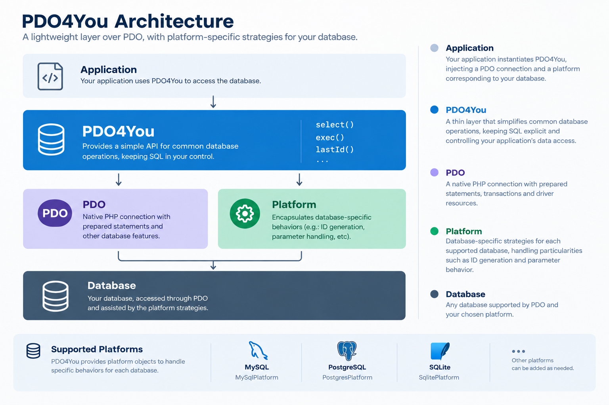

# PDO4You

[](https://www.php.net/)
[](LICENSE)

*[Leia a documentação em Português-BR](README-pt-BR.md)*

**A modern, lightweight, and testable database wrapper for PHP.**

**PDO4You** simplifies PDO usage without adding the overhead and complexity of a full ORM.

Built for **PHP 8.2+**, PDO4You keeps SQL under your control while adding an abstraction layer for common database operations, dependency injection, and platform-specific strategies.

> **PDO4You does not replace PDO. It works alongside it.**

---

## ✨ Features

* 🚀 **Lightweight** — A thin layer over PDO with minimal overhead.
* 🧩 **Simple** — Keep writing native SQL while maintaining full control over your queries.
* 💉 **Testable** — Full support for dependency injection (`PDO` and `DatabasePlatform`).
* ⚡ **Fast Setup** — `connect()` factory with automatic platform resolution from the DSN.
* 📦 **PSR-4** — Standard Composer-compatible autoloading.
* 🐘 **Modern PHP** — Strict typing and PHP 8.2+ features.
* 🔌 **Platform Strategies** — Abstraction of database-specific behavior (such as retrieving the last inserted ID) for MySQL, PostgreSQL, and SQLite.
* 🛡️ **Native Security** — Prepared statements across all parameterized operations.
* 🔄 **Managed Transactions** — Safe transaction handling through closures with automatic rollback.
* 📊 **Observability** — Global listener for logging, profiling, and execution-time monitoring.
* 🚫 **No ORM** — No entities and no mandatory complex mappings.

---

## 📦 Installation

Install PDO4You via Composer:

```bash
composer require giovanniramos/pdo4you
```

---

## ⚡ Quick Start

You can initialize PDO4You in two ways: automatically using a DSN string or by injecting an existing PDO connection.

### 1. Automatic Initialization (Recommended)

The static `connect()` method automatically resolves the proper platform driver from the DSN (`mysql`, `pgsql`, or `sqlite`):

```php
<?php

use PDO4You\PDO4You;

$db = PDO4You::connect(
    'mysql:host=localhost;dbname=mydb;charset=utf8mb4',
    'username',
    'password'
);
```

### 2. Manual Dependency Injection

Ideal for DI (Dependency Injection) containers or when reusing existing database connections:

```php
<?php

use PDO;
use PDO4You\PDO4You;
use PDO4You\Platform\MySqlPlatform;

// 1. Create your PDO instance
$pdo = new PDO(
    'mysql:host=localhost;dbname=mydb',
    'username',
    'password'
);

// 2. Instantiate the corresponding platform
$platform = new MySqlPlatform();

// 3. Inject dependencies into PDO4You
$db = new PDO4You($pdo, $platform);
```

---

## 🧑‍💻 Usage

### Queries (SELECT)

PDO4You provides dedicated methods for each read operation:

#### `select()` — Associative array or class mapping
```php
// Returns an associative array
$users = $db->select(
    'SELECT * FROM users WHERE status = ?',
    ['active']
);

// Direct mapping to class instances (FETCH_CLASS)
$users = $db->select(
    'SELECT * FROM users WHERE status = ?',
    ['active'],
    UserDTO::class
);
```

#### `selectOne()` — Fetch single row
Fetches only the first record, avoiding loading unnecessary datasets into memory:

```php
$user = $db->selectOne('SELECT * FROM users WHERE id = ?', [1]);

if ($user) {
    echo $user['name'];
}
```

#### `selectVal()` — Scalar value
Directly returns the value of the first column (useful for counts and sums):

```php
$total = $db->selectVal('SELECT COUNT(*) FROM users WHERE status = ?', ['active']);
```

#### `selectObj()` — Array of anonymous objects (`stdClass`)
```php
$users = $db->selectObj('SELECT name, email FROM users');

foreach ($users as $user) {
    echo $user->name;
}
```

#### `selectNum()` — Numerically indexed array
```php
$rows = $db->selectNum('SELECT id, name FROM users');
// $rows[0][0] = id, $rows[0][1] = name
```

---

### Execution (INSERT, UPDATE, DELETE)

The `exec()` method handles data modification operations and returns the number of affected rows.

#### Simple Execution
```php
// UPDATE
$affected = $db->exec(
    'UPDATE users SET status = ? WHERE id = ?',
    ['inactive', 5]
);

// DELETE
$affected = $db->exec(
    'DELETE FROM users WHERE id = ?',
    [10]
);
```

#### Batch Execution (Batch Insert / Batch Update)
When you pass a list of arrays, PDO4You reuses the same prepared statement to execute all items efficiently:

```php
$totalInserted = $db->exec(
    'INSERT INTO users (name, surname) VALUES (?, ?)',
    [
        ['John', 'Doe'],
        ['Jane', 'Doe'],
        ['Alice', 'Smith']
    ]
);
```

---

### Last Inserted ID

Retrieves the identifier generated by the last operation using the strategy corresponding to the active platform:

```php
$db->exec('INSERT INTO users (name) VALUES (?)', ['John']);

$userId = $db->lastId();

// For PostgreSQL with specific sequences:
// $userId = $db->lastId('users_id_seq');
```

---

### Managed Transactions

The `transaction()` method wraps operations in a safe transactional block. If the callback completes successfully, `commit` is triggered; if any exception occurs, an automatic `rollBack` is performed:

```php
$db->transaction(function (PDO4You $db) {
    $db->exec('UPDATE accounts SET balance = balance - 100 WHERE id = ?', [1]);
    $db->exec('UPDATE accounts SET balance = balance + 100 WHERE id = ?', [2]);
});
```

Manual controls (`beginTransaction()`, `commit()`, `rollBack()`, and `inTransaction()`) are also directly available on the instance.

---

### Observability and Logging (Query Listener)

Monitor and audit the execution time and parameters of every query. The listener is isolated to ensure observability failures never interfere with database execution:

```php
PDO4You::onQuery(function (string $sql, array $params, float $durationMs) {
    if ($durationMs > 50.0) {
        // Log slow queries
        error_log(sprintf('[Slow Query: %.2fms] %s | Params: %s', $durationMs, $sql, json_encode($params)));
    }
});
```

---

## 🔌 Platforms

PDO4You uses objects based on the `PDO4You\Platform\DatabasePlatform` interface to handle database-engine-specific behavior:

* `PDO4You\Platform\MySqlPlatform` — Support for MySQL and MariaDB.
* `PDO4You\Platform\PgSqlPlatform` — Support for PostgreSQL (including *sequences*).
* `PDO4You\Platform\SqlitePlatform` — Support for SQLite.

---

## 🏗️ Architecture

PDO4You adds a thin layer over PDO, keeping SQL explicit while allowing database-specific behavior to be encapsulated through platforms.



---

## 🎯 Why PDO4You?

PDO already provides an excellent native API for database access, while full ORMs introduce robust abstraction layers. **PDO4You** was designed to fill the space between them: a lightweight convenience layer without giving up control over SQL.

- **Simpler than an ORM** — no entities, models, or mandatory mapping.
- **More convenient than raw PDO** — direct selection methods, consistent error handling, and batch execution.
- **SQL remains under your control** — you write the queries and decide how data is accessed.

---

## ⚡ Quick Test

After installing the dependencies, you can quickly verify that PDO4You is working using the script included in the project root:

```bash
php quick-test.php
```

---

## 🧪 Examples

The project includes a suite of practical usage examples.

To view the examples through a web interface, start PHP's built-in server:

```bash
php -S localhost:8000 -t examples
```

Then open the following URL in your browser:

```text
http://localhost:8000
```

The examples use an in-memory SQLite database by default, allowing you to experiment with the library without configuring a database server.

---

## 🛠️ Development

Clone the repository and install the dependencies:

```bash
git clone https://github.com/giovanniramos/PDO4You.git
cd PDO4You
composer install
```

Run the tests with PHPUnit:

```bash
./vendor/bin/phpunit tests
```

To run the tests in an isolated Docker environment:

```bash
docker compose build -q --no-cache
docker compose run --rm test
```

---

## 📋 Requirements

* **PHP:** 8.2 or higher
* **PDO Extensions:** `pdo` and the corresponding driver (`pdo_mysql`, `pdo_pgsql`, or `pdo_sqlite`)
* **Composer**

---

## 📄 License

PDO4You is distributed under the **MIT** license. See the `LICENSE` file for details.
